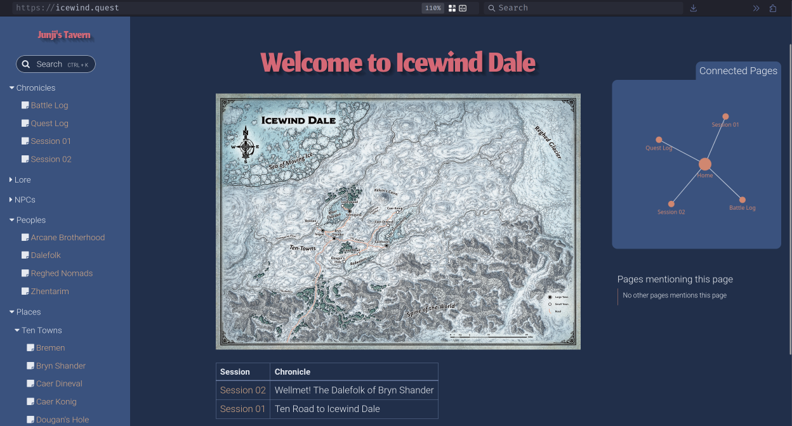

# icewind.quest
[icewind.quest](https://icewind.quest) is a hosted Zettelkasten-style notebook. You may find this interesting if you're into obsidian notebooking tricks, Zettelkasten ideas, or - in the case of my content - a Dungeons and Dragons game. This was a quick hobby project, in terms of the notebook setup, but if you can think of any nice improvements, raise an issue.

## the results
Click the image to check out the site. 

## obsidian-icewind
[icewind.quest](https://icewind.quest) is a hosted Zettelkasten-style notebook using [obsidian.md](https://obsidian.md) alongside the plugins [obsidian-dataview](https://blacksmithgu.github.io/obsidian-dataview/) and [obsidian-digital-garden](https://github.com/oleeskild/obsidian-digital-garden), which respectively handle data manipulations and help turn the vault into a website.

If you're familiar with obsidian, the main takeaways are: **(1)** you can easily evolve your notebook into a website with the obsidian-digital-garden plugin and **(2)** the scripting in my notebook does a *lot* of heavy lifting when it comes to tracking reoccuring entities, in this case characters, events, and locations in a Dungeons and Dragon campaign.  With a minimal amount of tagging, obsidian-dataview scripts allow for nearly self-generated character page content, for example.

## the workflow
I'm often pressed for time, so the point of this notebook is to keep it simple. I'll keep the context of a D&D campaign for this dialogue, but you may find inspiration to adopt the flow to another purpose. 

You make pages for Characters and Locations from templates. You then compose detailed Session notes, logging the events of each day's activities. These Session notes will contain markup links which are then scraped by the dataview plugin and populate the aforementioned pages. Not everything is automated, but enough content gets linked around that it's very easy to see at a glance what interactions your players have made. You just need to keep quality logs for each Session.

For example, for each new character the party encounters:
- create a NPC page using the [NPC template](https://github.com/shervinsahba/obsidian-icewind/tree/main/_templates)
- tag the character using a markup link during [Session](https://github.com/shervinsahba/obsidian-icewind/tree/main/Chronicles) logs

That's it. The dataview script on the character page will then scrape all Sessions for the linked character, like [this example](https://icewind.quest/characters/ten-towns/bryn-shander/markham-southwell/). The same idea is repeated for quests, battles, and locations. Simple!

## tell me more about dungeons and dragons
See, my adult friends and I would rather like to be wizards, but all attempts to conjure fireballs have failed. Dungeons and Dragons is a table top roleplaying game that lets us pretend to be wizards while drinking beer, so it all works out. I'm running a modified campaign of [Icewind Dale: Rime of the Frostmaiden](https://en.wikipedia.org/wiki/Icewind_Dale:_Rime_of_the_Frostmaiden), hence the frosty content.

